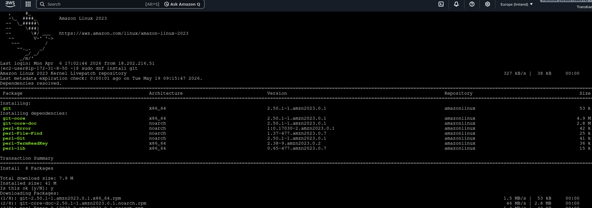
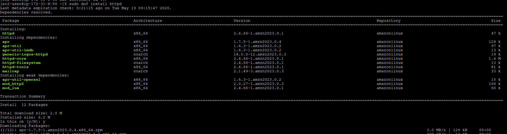
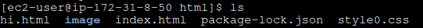
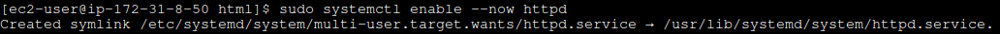
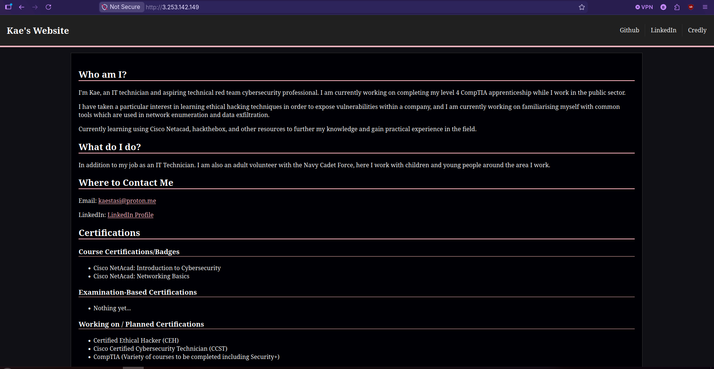

## Configuring an AWS Web Server

This Document will outline the process of what I have done to create a very simple web server using an EC2 AWS Instance.

## Creating the VM

Before we can get our server configured, we will need to create the Virtual Machine that it will run on. For this, I am using an EC2 AWS Instance which can be found by signing in to the AWS admin console, going to services, and selecting EC2.

Now we will be in the configuration panel for this VM, and we could use the following settings:

However, this would not be an ideal setup for an actual live website as this has a configuration issue which could pose a security threat; allowing SSH traffic from any IP address means that anyone who gains access to our SSH key is able to remote in to this VM and hijack our website.

Now I will configure the security group that the VM belongs in to allow TCP connections on port 8080 from any IP. This will be the port responsible for HTTP communications as using a higher port number because Linux requires additional configuration for lower port numbers.

## Creating Buckets

Now we will create a bucket which will be used for storing any files which will be displayed on the website. The bucket will be configured with the following settings (any omitted settings have been left as their defaults):

Next is to create a bucket policy which will allow anyone to have read access to files within the bucket.

[source of the script was from this video](https://www.youtube.com/watch?v=Nzv-tzU-UAw)

## Running the server

Here, I diverged a little bit from what I had done previously and changed the port 8080 rule to be the default http port 80 rule as I realised that for my purposes, this was much easier than using a different port.

To begin with, I installed git and Apache on to the EC2 instance shown below:

I then cloned my website's repository and moved the files to the /var/www/html folder in the EC2 instance. This resulted in the folder looking like this when running ls:

Now I enable and start the httpd (Apache) service to start hosting the contents of http on port 80 of my instance's public IP address:

Finally, I can go to a web browser and type in the public IPv4 address of my instance and my website appears as follows:

All the images are hosted within my EC2 instance which is something that the S3 bucket would be useful for in the case that I had a larger website with more images or videos.