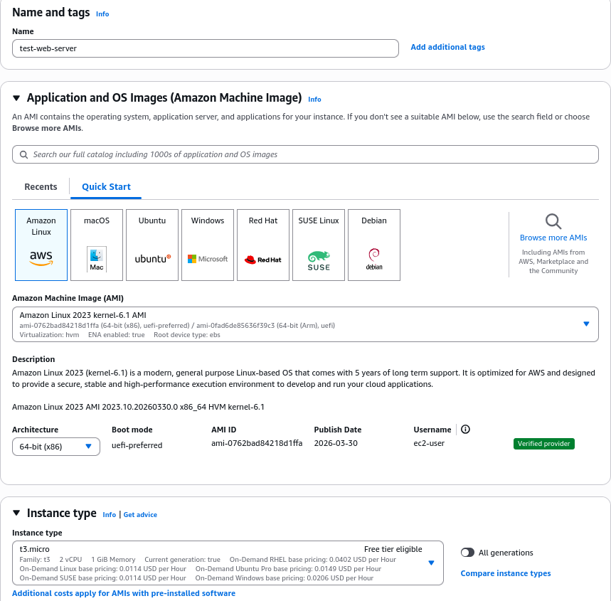
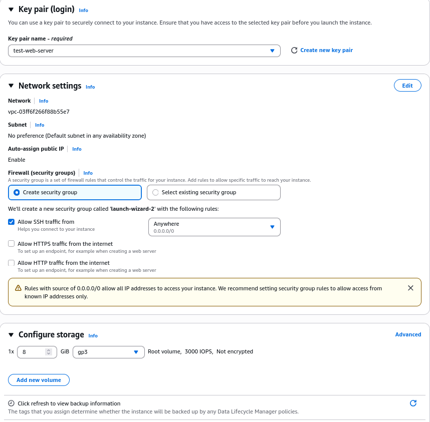
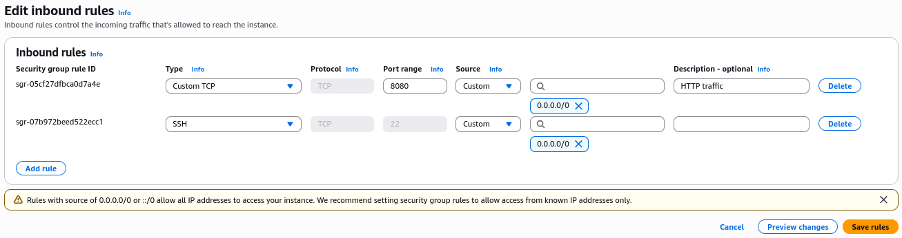
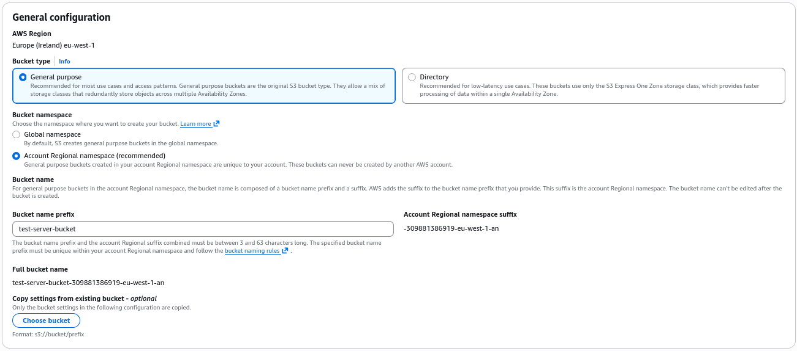
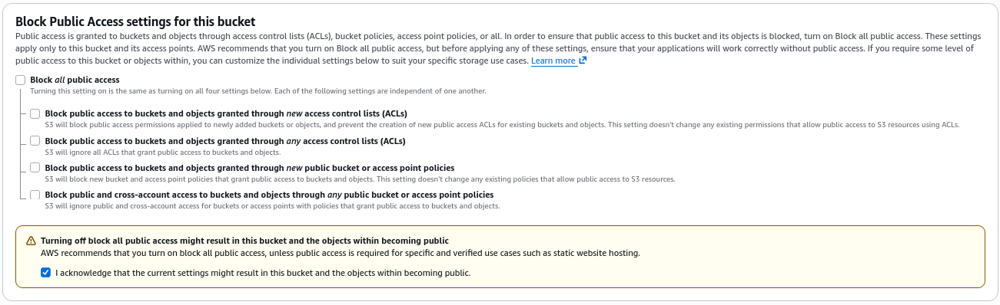
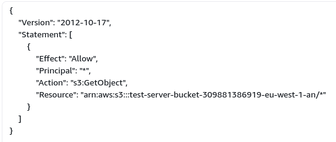

## Configuring an AWS Web Server

This Document will outline the process of what I have done to create a very simple web server using an EC2 AWS Instance.

## Creating the VM

Before we can get our server configured, we will need to create the Virtual Machine that it will run on. For this, I am using an EC2 AWS Instance which can be found by signing in to the AWS admin console, going to services, and selecting EC2.

Now we will be in the configuration panel for this VM, and we could use the following settings:

However, this would not be an ideal setup for an actual live website as this has a configuration issue which could pose a security threat; allowing SSH traffic from any IP address means that anyone who gains access to our SSH key is able to remote in to this VM and hijack our website.

Now I will configure the security group that the VM belongs in to allow TCP connections on port 8080 from any IP. This will be the port responsible for HTTP communications as using a higher port number because Linux requires additional configuration for lower port numbers.

## Creating Buckets

Now we will create a bucket which will be used for storing any files which will be displayed on the website. The bucket will be configured with the following settings (any omitted settings have been left as their defaults):

Next is to create a bucket policy which will allow anyone to have read access to files within the bucket.

[source of the script was from this video](https://www.youtube.com/watch?v=Nzv-tzU-UAw)

